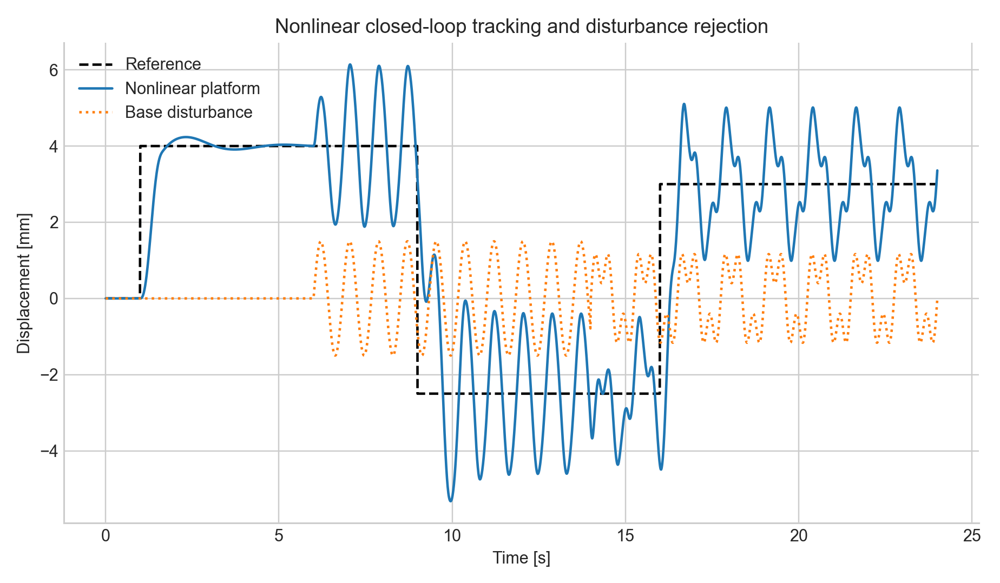
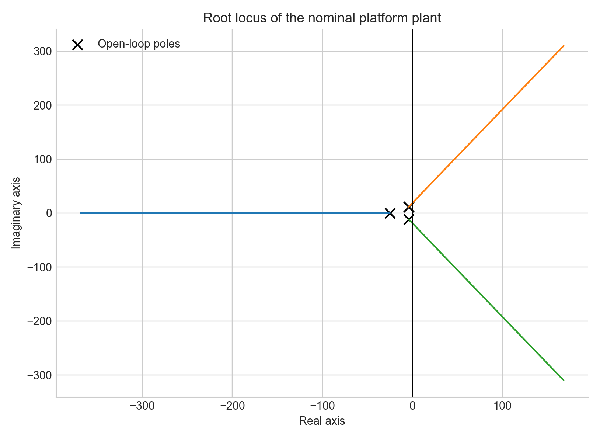

# Active Anti-Vibration Platform: Modeling and IMC Control

Computational control-systems portfolio from the Control course at Universidad
de los Andes. The featured project is an active anti-vibration platform for
isolating sensitive equipment from base disturbances.

The repository combines a MATLAB/Simulink implementation with a portable Python
analysis that regenerates stability plots, frequency-response figures,
root-locus diagrams, time-domain simulations, and numerical summaries.



## Project Abstract

The featured system is a single-degree-of-freedom isolation platform with a
first-order actuator. A nominal linear model supports Internal Model Control
(IMC) design, while a nonlinear model introduces cubic stiffness, smoothed
Coulomb friction, actuator saturation, and mechanical stops. The project
evaluates the difference between nominal and realistic behavior and documents
the controller rationale using reproducible computational analysis.

## Engineering Objectives

- Derive a third-order plant model from mechanical and actuator dynamics.
- Design an IMC-based feedback controller for reference tracking.
- Evaluate open-loop stability and closed-loop performance.
- Compare nominal and nonlinear platform behavior.
- Quantify disturbance rejection and actuator effort.
- Preserve MATLAB/Simulink artifacts while providing a portable Python workflow.

## Mathematical Formulation

The nominal plant is

```math
G(s)=\frac{K_a}{(\tau_a s+1)(m s^2+c s+k)}
```

with `m = 12 kg`, `c = 95 N s/m`, `k = 1800 N/m`,
`K_a = 220 N/V`, and `\tau_a = 0.04 s`.

The IMC filter and equivalent feedback controller are

```math
F(s)=\frac{1}{(\lambda s+1)^3}, \qquad
G_c(s)=
\frac{(\tau_a s+1)(m s^2+c s+k)}
{K_a \lambda s(\lambda^2s^2+3\lambda s+3)}
```

where `\lambda = 0.10 s`. See
[Mathematical Formulation](docs/mathematical-formulation.md) for the state-space
model, nonlinear forces, stability analysis, and controller rationale.

## Assumptions

- The nominal suspension is linear and represented by lumped parameters.
- The actuator is modeled as a first-order force source.
- The nonlinear comparison includes cubic stiffness, smoothed Coulomb friction,
  voltage saturation, and hard stops.
- The Python companion reproduces the engineering analysis without requiring
  MATLAB; Simulink remains the primary block-diagram implementation.

## Methodology

1. Define physical parameters and derive `G(s)`.
2. Convert the transfer function to state space and inspect its poles.
3. Construct the IMC controller and nominal closed-loop response.
4. Simulate linear and nonlinear open-loop behavior.
5. Simulate nonlinear feedback tracking under base excitation.
6. Export figures and machine-readable metrics.

## Results

Generated artifacts are committed under [`figures/`](figures/) and
[`results/`](results/). The workflow produces:

- plant Bode response;
- root-locus diagram;
- linear versus nonlinear open-loop comparison;
- nominal closed-loop step response;
- nonlinear tracking and disturbance-rejection response;
- state-space matrices and performance metrics.




## Discussion

The project demonstrates the full control-engineering chain: physical
modeling, linearization, transfer-function analysis, state-space conversion,
frequency-domain reasoning, controller design, and nonlinear validation. The
portable Python layer makes the evidence reviewable by admissions committees
and engineering recruiters without specialized proprietary software.

## Repository Structure

```text
docs/        GitHub Pages-ready technical documentation
figures/     Generated publication-quality plots
notebooks/   Preserved computational notebooks
reports/     Selected course reports and submissions
results/     Generated numerical summaries and response data
src/         Python analysis, MATLAB models, and Simulink assets
tests/       Lightweight regression tests
```

## Installation

```bash
python3 -m venv .venv
source .venv/bin/activate
python -m pip install -r requirements.txt
```

MATLAB users can also run
[`src/matlab/anti_vibration_platform/run_all.m`](src/matlab/anti_vibration_platform/run_all.m).

## Reproducibility

```bash
python src/python/control_portfolio.py
python -m unittest discover -s tests -v
```

See [Reproducibility Guide](docs/reproducibility.md) for generated files and
MATLAB/Simulink notes.

## Future Work

- Validate the model using measured platform acceleration and actuator data.
- Add robust-control comparisons such as loop shaping or `H_\infty` synthesis.
- Integrate accelerometer feedback and real-time hardware-in-the-loop testing.
- Compare transmissibility across passive, semi-active, and active isolators.

## References

- K. J. Åström and R. M. Murray, *Feedback Systems*, Princeton University Press.
- G. F. Franklin, J. D. Powell, and A. Emami-Naeini, *Feedback Control of
  Dynamic Systems*, Pearson.
- M. Morari and E. Zafiriou, *Robust Process Control*, Prentice Hall.

## Documentation

Start with the [GitHub Pages-ready documentation](docs/index.md) and the
[portfolio evaluation](docs/portfolio-evaluation.md).
