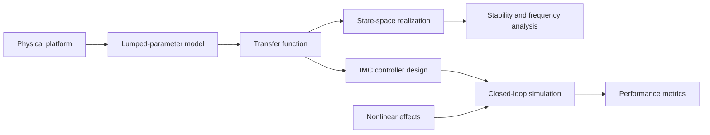
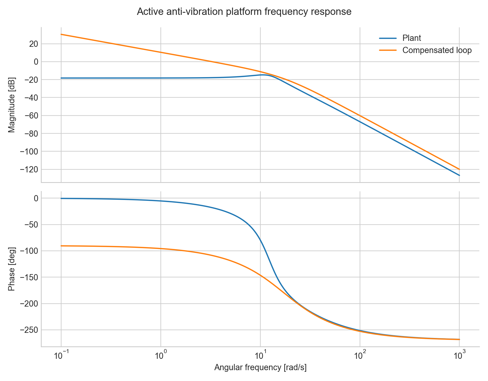

# Active Anti-Vibration Platform

This GitHub Pages-ready site documents the featured project from the Control
course at Universidad de los Andes.

## Engineering Workflow

## Documentation Map

- [Mathematical formulation](mathematical-formulation.md)
- [Reproducibility guide](reproducibility.md)
- [Portfolio evaluation](portfolio-evaluation.md)

## Generated Evidence

